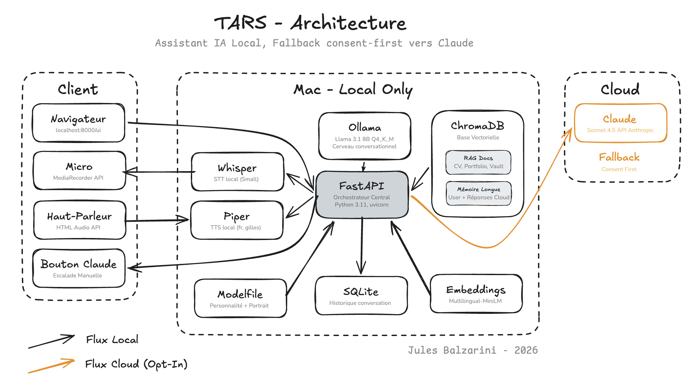

# TARS — local personal AI assistant

TARS is a privacy-first AI assistant I'm building to learn applied AI in depth. Inspired by the TARS robot from *Interstellar*, it runs primarily locally on my Mac, with a controlled fallback to a cloud model for tasks beyond the local model's capabilities.

This project is both a learning support and a tool I use daily. I document technical choices, trade-offs, and limitations encountered along the way.

## Features

- **Custom LoRA fine-tuning** of Llama 3.1 8B on a synthetic conversational dataset, to encode the TARS personality into the weights instead of relying on a large system prompt.
- **Text and voice conversation**, fully local (Whisper for transcription, Piper for speech synthesis, Llama 3.1 8B for generation).
- **RAG** over personal documents (CV, portfolio, Obsidian vault linked via symlink) with ChromaDB and multilingual embeddings.
- **Semantic long-term memory**: substantial user messages and cloud model responses (when invoked) are ingested into a dedicated collection, allowing retrieval of past exchanges.
- **Read-only Gmail and Google Calendar integrations**: recent emails and upcoming events are injected into context, powering a startup briefing.
- **Cloud fallback** with three independent triggers: explicit user request, model self-signaling via a structured token, and a manual UI button.
- **Consent-first**: every external call is an explicit user decision, with control over what leaves the Mac.
- **Minimalist web interface** available at `localhost:8000/ui`.

## Architecture

The system follows a classic client-server pattern with a FastAPI backend orchestrating several modules:

- **Browser** → web interface at `localhost:8000/ui`
- **FastAPI** → central orchestrator
- **Ollama** → Llama 3.1 8B (fine-tuned), local, conversational core
- **Whisper small** → audio → text transcription, local
- **Piper** → text → audio synthesis, French voice, local
- **ChromaDB** → vector database for RAG and long-term memory, local
- **SQLite** → conversation history, local
- **Google APIs** → read-only Gmail and Calendar for daily context
- **Cloud API** → more powerful model, invoked only on explicit validation

The full pipeline works offline for daily conversation. The cloud model is never invoked by default.

## Fine-tuning

To reduce dependency on a large system prompt and make the personality more stable, I fine-tuned Llama 3.1 8B with a LoRA adapter on a custom dataset, and ran the full pipeline end-to-end.

**Pipeline.** Synthetic dataset generation via the Anthropic API (dialogues in the TARS style, plus extracted movie lines as a style reference) → LoRA training (rank 16, alpha 32, 3 epochs) → merge into the base model → GGUF conversion → Q4_K_M quantization → import into Ollama. GPU training on Colab; merge, conversion and quantization done locally on Apple Silicon after hitting Colab's free-tier limits.

**The key lesson — dataset quality over style.** My first dataset (v1, 200 dialogues) produced a model with excellent TARS style but that hallucinated confidently: it invented facts rather than admitting ignorance. The cause was the dataset itself — an LLM generating example dialogues fills them with plausible but invented facts, so I had effectively taught the model to *always* produce an assured answer. I rebuilt a v2 dataset (400 dialogues) where 45% of examples explicitly teach abstention ("I don't know"), grounding on provided context, and briefing generation. The v2 model keeps the style while correctly refusing to invent personal facts.

**Takeaway.** The quality of a fine-tuning dataset isn't measured by style but by what it implicitly teaches. A dataset that never contains abstention teaches the model to never abstain. Fine-tuning personality on a small corpus is a real trade-off between style and factual reliability.

## Tech stack

- **Backend**: Python 3.11, FastAPI, uvicorn, aiosqlite, httpx
- **Local LLM**: Ollama, Llama 3.1 8B Q4_K_M, fine-tuned via LoRA
- **Fine-tuning**: Unsloth (LoRA training), PEFT, llama.cpp (GGUF conversion + quantization)
- **Cloud LLM (fallback)**: Anthropic API, Sonnet model
- **Voice**: Whisper small (STT), Piper with fr_FR-gilles-low voice (TTS)
- **RAG**: ChromaDB, sentence-transformers (paraphrase-multilingual-MiniLM-L12-v2)
- **Integrations**: Google Gmail & Calendar APIs (read-only)
- **Frontend**: Vanilla HTML/CSS/JS, MediaRecorder API for microphone

## What I learned building TARS

This project made me touch several concepts I only knew theoretically.

**On models.** Distinguishing model, runtime, and quantization. Understanding why an 8B in Q4 fits in 5 GB while the same model in FP16 takes 16 GB. Empirically observing that pure prompt engineering hits limits fast on a small model. Fine-tuning taught me the rest of the stack hands-on: LoRA rank and alpha, the merge/convert/quantize chain, the recurring tokenizer pitfalls of Llama 3.1 in GGUF conversion, and above all that a fine-tuning dataset teaches behavior implicitly — not just style.

**On RAG.** That semantic similarity favors prose-rich documents over structured ones like CVs. That chunk size and distance threshold are real decisions to make empirically, not defaults to leave alone. That the real challenge of RAG isn't the pipeline (easy) but corpus quality (hard).

**On orchestration.** That cloud fallback isn't just an API call, but an architecture and privacy question: what data is allowed to leave, under what user control, with what traceability. I implemented an escalation architecture with three independent triggers (explicit user request, a structured token the model can emit when it doubts itself, and a manual button), so that the reliable paths never depend on a fragile phrase produced by the model. Every external call is a deliberate decision.

**On memory.** That an LLM doesn't "remember" in the strong sense, and that what we call memory is reconstruction at each turn. That storing everything is noisy and requires curation: my ingestion rules (only substantial user messages and validated cloud responses) prevent the snowball effect of self-reinforcing hallucinations.

**On trade-offs.** That "100% local" is a principle you sometimes have to compromise. Cloud fallback exists to avoid mediocre responses, but stays explicit and optional.

## Known limitations

- The fine-tuned model captures the TARS style well but occasionally produces odd phrasings, and its self-triggered escalation is not yet reliable (the dependable escalation paths are the explicit user request and the manual button). Both are documented trade-offs of fine-tuning on a small dataset.
- Llama 3.1 8B follows instructions imperfectly as context accumulates. Escalation to a larger model remains possible but optional, and under explicit user control.
- RAG performs worse on highly structured documents (CV) than on prose (portfolio). Long-term fix: enrich the corpus with narrative content.
- Piper voice is decent but far from ElevenLabs. Trade-off accepted to keep TTS fully local.
- Incremental ingestion triggers on server startup, not in real time. A note taken in Obsidian while TARS is running is only indexed at the next restart.

## Planned next steps

- Improve auto-escalation reliability by adding `[ESCALADE]` token examples to the fine-tuning dataset (v3).
- A lightweight evaluation harness to compare model versions on a fixed prompt set.
- Mobile version via Tailscale and PWA.

## Requirements

- macOS Apple Silicon (M1+) with 16 GB RAM minimum, 24 GB recommended
- Python 3.11
- Homebrew, Ollama
- An API key for the fallback model (optional)

## Installation

Coming soon.

## Project structure

- `main.py` — FastAPI server, main routes, escalation orchestration
- `ingest.py` — Incremental document ingestion into ChromaDB
- `embeddings.py` — Embedding model singleton
- `memory.py` — Semantic long-term memory
- `escalation.py` — Cloud fallback logic with three independent triggers
- `audio.py` — STT (Whisper) and TTS (Piper)
- `gmail_client.py` / `calendar_client.py` — Read-only Google integrations
- `dataset/` — Fine-tuning dataset generation scripts and data (v1, v2)
- `finetune/` — Modelfiles and merge script (LoRA adapter and GGUF weights gitignored)
- `index.html` — Web interface
- `knowledge/` — Personal documents (gitignored)
- `voices/` — Piper voices (gitignored)

---

*Project by Jules Balzarini.*
